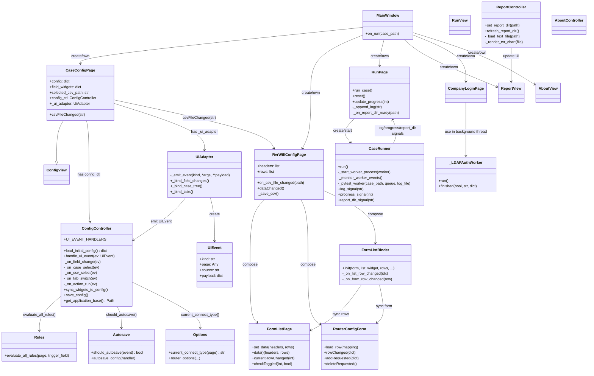
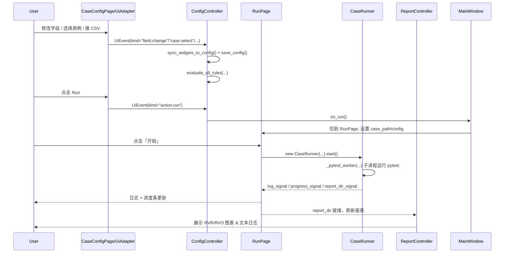

# UI 框架深度分析文档

> 基于当前项目 `src/ui` 目录结构的整体分析

---

## 1. 总体架构概览

本项目的 UI 部分整体是一个 **MVC + 规则引擎** 的结构，大致链路可以概括为：

> **MainWindow → 各个 Page(View) → UiAdapter(事件适配) → Controller(业务逻辑) → Model(配置 / 规则 / 自动保存) → Run/Report 测试执行与报表**

- **View 层**：Qt 界面（各种 Page、表格、表单、对话框）
- **Controller 层**：处理 UI 事件、保存配置、调用规则、触发运行
- **Model 层**：配置、规则、自动保存策略、下拉选项等
- **执行层**：`CaseRunner(QThread)` + 子进程 pytest 执行 + 报表解析

---

## 2. 包结构与职责

### 2.1 `src/ui/__init__.py`

- 定义侧栏页签：
  - `SIDEBAR_PAGE_KEYS`
  - `SIDEBAR_PAGE_LABELS`
- 提供统一的配置读写入口：
  - `load_config` / `save_config`
  - `load_page_config(page)` / `save_page_config(page)`
  - `load_config_page_state(page)` / `save_config_page_state(page)`
- re-export 核心 View 组件：
  - `FormListPage`
  - `RouterConfigForm`
  - `FormListBinder`
  - `bind_view_events`
  - `determine_case_category` 等

> 这里可以被视为 UI 模块的“门面（facade）”，对外提供稳定 API。

---

### 2.2 View 层（`src/ui/view/`）

主要文件：

- `main_window.py`：**主窗口**
  
  - 创建所有页面：配置页、RvR Wi-Fi 页、运行页、报表页、登录页、关于页
  - 负责侧边栏按钮与页的切换
  - 提供 `on_run()` 回调给配置页，用于触发运行逻辑

- `config/page.py`：**配置页 View**
  
  - `ConfigView`：基础配置页骨架
  - `CaseConfigPage`：具体业务配置页，集成：
    - 用例树（case tree）
    - 配置 tab（比如 stability / execution / compatibility）
    - `ConfigController`
    - `UiAdapter`
    - 自动加载/保存配置

- `case.py`：**RvR Wi-Fi Case 页面**
  
  - `RvrWifiConfigPage`
  - 内部使用：
    - `FormListPage`：CSV 表格
    - `RouterConfigForm`：单行编辑表单
    - `FormListBinder`：表单↔表格绑定

- `run.py`：**运行页**
  
  - `RunView`
  - `RunPage`：提供 run/stop 按钮、日志窗口、进度条，管理 `CaseRunner`

- `report.py`：**报表页**
  
  - `ReportView`
  - 图表展示组件，文本日志查看

- `account.py`：**登录页**
  
  - `CompanyLoginPage`（LDAP 登录）

- `about.py`：**关于页**
  
  - `AboutView`

- `builder.py`：**表单构建工具**
  
  - 根据 YAML schema 动态构建表单控件

- `common.py`：通用控件
  
  - `ConfigGroupPanel`
  - `TestFileFilterModel` 等

- `ui_adapter.py`：**核心事件适配层**
  
  - `UiAdapter`
  - `UiEvent`
  - 把各种 Qt 信号统一转换为结构化的 `UiEvent`，交给 Controller

- `view_events.yaml`：
  
  - 声明式事件绑定表（旧逻辑），
  - 现在逐渐被 `UiAdapter` + `UiEvent` 方案取代，但仍有兼容。

---

### 2.3 Controller 层（`src/ui/controller/`）

核心文件：

- `config_ctl.py`：**配置控制器**
  
  - `ConfigController`
    - 负责：
      - 加载初始配置
      - 处理 UI 事件（字段变更、用例选择、CSV 选择、tab 切换、run 按钮等）
      - 同步 UI → config dict
      - 自动保存到 YAML
      - 调用规则引擎更新 UI 状态
    - 通过多个 mixin 拆分不同业务逻辑：
      - `_ConnectTypeControllerMixin`
      - `_StabilityControllerMixin`
      - `_CsvRvrControllerMixin`
      - `_RouterControllerMixin`
      - `_EditableStateControllerMixin`

- `case_ctl.py`：
  
  - RvR Wi-Fi Case 页面 CSV / Switch Wi-Fi 辅助逻辑

- `run_ctl.py`：**运行控制器**
  
  - `CaseRunner(QThread)`
    - 在子线程中拉起子进程运行 pytest
    - 通过队列把日志/进度/报表目录发回主线程
  - `_pytest_worker(...)`
    - 真正跑 pytest 的函数，在子进程中执行

- `report_ctl.py`：**报表控制器**
  
  - `ReportController`
    - 扫描 report 目录
    - 区分 RVR/RVO 文件与普通日志
    - 绘图 & 文本展示

- `account_ctl.py`：登录控制器
  
  - `_LDAPAuthWorker`：后台线程做 LDAP 验证

- `about_ctl.py`：关于页逻辑

- `__init__.py`：
  
  - 一些通用 UI 辅助函数：
    - `show_info_bar`
    - `info_bar_parent`
    - `set_run_locked`
    - `list_serial_ports`

---

### 2.4 Model 层（`src/ui/model/`）

- `options.py`：
  
  - 提供各种下拉选项数据，如：
    - `current_connect_type(page)`
    - `router_options(...)` 等

- `rules.py`：**规则引擎**
  
  - 核心类型：
    - `SimpleRuleSpec`
    - `SimpleFieldEffect`
  - 规则集合：
    - `CUSTOM_SIMPLE_UI_RULES`
    - `CUSTOM_TESTCASE_UI_RULES`
  - 主函数：
    - `evaluate_all_rules(page, trigger_field)`
      - 收集所有字段当前值
      - 根据 trigger 字段遍历规则表
      - 生成 effect，最终通过 page / adapter 控制控件：
        - 显示/隐藏
        - 使能/禁用
        - 修改选项等

- `autosave.py`：**自动保存策略**
  
  - `AUTOSAVE_EVENTS`：定义会触发自动保存的事件名
  - `should_autosave(event)`
  - `autosave_config(handler)`：装饰器；兼容旧的 `handle_config_event` 方式

---

## 3. 关键流程拆解

### 3.1 Config 页面初始化流程

以 `CaseConfigPage` 为例：

1. `CaseConfigPage.__init__(on_run_callback)`：
   
   - 初始化 UI：用例树 + tab + 各种 `ConfigGroupPanel`
   - 创建控制器：
     
     ```python
     self.config_ctl = ConfigController(self)
     ```
   - 加载初始配置：
     
     ```python
     self.config = self.config_ctl.load_initial_config()
     ```
   - 用 `builder` 根据 YAML schema 构建表单；填充 `field_widgets` / `config_controls`
   - 创建 `UiAdapter`：
     
     ```python
     self._ui_adapter = UiAdapter(self, self.config_ctl.handle_ui_event)
     ```
   - 使用 `bind_view_events(page, "config", handle_config_event)` 兼容旧逻辑

2. `UiAdapter` 在内部绑定：
   
   - 字段变更信号 → `UiEvent(kind="field.change", ...)`
   - 用例树点击 → `UiEvent(kind="case.select", ...)`
   - CSV 下拉变化 → `UiEvent(kind="csv.select", ...)`
   - tab 变化 → `UiEvent(kind="tab.switch", ...)`
   - run 按钮点击 → `UiEvent(kind="action.run")`

3. 所有 `UiEvent` 都统一交给 `ConfigController.handle_ui_event` 处理。

---

### 3.2 字段变更 → 自动保存 + 规则引擎

1. 某个控件触发变更：
   
   - 例如 `textChanged`, `currentIndexChanged`, 自定义 `entriesChanged` 等
   - `UiAdapter` 捕获并创建：
     
     ```python
     UiEvent(kind="field.change", payload={"field": field_id, "value": value, ...})
     ```

2. `ConfigController.handle_ui_event(ev)`：
   
   - 使用一张派发表：
     
     ```python
     UI_EVENT_HANDLERS = {
         "field.change": self._on_field_change,
         "case.select": self._on_case_select,
         "csv.select": self._on_csv_select,
         "tab.switch": self._on_tab_switch,
         "action.run": self._on_action_run,
         ...
     }
     ```

3. `_on_field_change(ev)` 典型逻辑：
   
   - 处理兼容性字段联动
   - 判断是否需要自动保存：
     
     ```python
     if field != "csv_path" and should_autosave("field_changed") and not page._refreshing:
         self.sync_widgets_to_config()
         self.save_config()
     ```
   - 调用规则引擎：
     
     ```python
     evaluate_all_rules(page, trigger_field=field)
     ```

4. `sync_widgets_to_config()`：
   
   - 遍历 `page.field_widgets`
   - 把当前控件值写回 `self.config` dict

5. `save_config()`：
   
   - 通过 `ui.save_config_page_state(page)`
   - 最终落地为 YAML 文件。

---

### 3.3 用例选择 / CSV 选择流程

#### 用例选择

1. 用户点击用例树：
   
   - `UiAdapter` 绑定 `QTreeView.clicked` 信号
   - 根据 `proxy_model` / `fs_model` 计算真实用例路径
   - 生成 `UiEvent(kind="case.select", payload={"case_path": ..., "display_path": ...})`

2. `ConfigController._on_case_select(ev)`：
   
   - 更新 `page._current_case_path` 与 `_current_case_display_path`
   - 如果有 `text_case` 字段则更新文本
   - 调用 `apply_ui(page, case_path)` 做额外 UI 调整
   - 根据用例类型自动切换 tab（stability / execution 等）

#### CSV 选择

1. 用户在配置页换 CSV：
   
   - 对应 Qt 信号被 `UiAdapter` 捕获
   - 生成 `UiEvent(kind="csv.select", ...)`

2. `ConfigController._on_csv_select(ev)`：
   
   - 更新 config 中的 CSV 路径字段
   - 调用 `sync_switch_wifi_on_csv_changed(page, new_path)`
   - 视情况触发 `sync_widgets_to_config` + `save_config`

---

### 3.4 Run 流程：从配置到测试执行

1. 用户在配置页点击 run（按钮）：
   
   - `UiAdapter` 发出 `UiEvent(kind="action.run")`
   - `ConfigController._on_action_run`：
     
     ```python
     def _on_action_run(self, event: UiEvent) -> None:
         _ = event
         self.on_run()  # CaseConfigPage 初始化时传入的回调 => MainWindow.on_run
     ```

2. `MainWindow.on_run`：
   
   - 切到 `RunPage`
   - 把当前：
     - `case_path`
     - `display_case_path`
     - `config`
   - 传给 `RunPage`

3. `RunPage.run_case()`：
   
   ```python
   self.reset()
   self._set_action_button("stop")
   
   self.runner = CaseRunner(self.case_path, account_name=account_name, display_case_path=self.display_case_path)
   self.runner.log_signal.connect(self._append_log)
   self.runner.progress_signal.connect(self.update_progress)
   self.runner.report_dir_signal.connect(self._on_report_dir_ready)
   self.runner.finished.connect(self._finalize_runner)
   self.runner.start()
   ```

4. `CaseRunner(QThread)`：
   
   - `run()` 中：
     - `_start_worker_process(self._pytest_worker, ...)`：新建子进程
     - `_monitor_worker_events()`：从队列读取事件
   - 子进程 `_pytest_worker(case_path, q, log_file)`：
     - 初始化 pytest 环境
     - 执行 pytest
     - 把日志/进度/报表目录等通过队列发给主线程：
       - `"log"` → `log_signal.emit(...)`
       - `"progress"` → `progress_signal.emit(...)`
       - `"report_dir"` → `report_dir_signal.emit(...)`

5. Run 页收到 `report_dir_signal`：
   
   - 调用 `ReportController.set_report_dir(path)`
   - `ReportController.refresh_report_dir()` 扫描目录，解析报表/日志
   - 触发报表页 UI 更新。

---

## 4. RvR Wi-Fi Case 页内部结构

### 4.1 三个核心类

1. **FormListPage**
   
   - 通用列表/表格组件，可用于 CSV 数据：
     - `set_data(headers, rows)`
     - `data() -> (headers, rows)`
     - 信号：
       - `currentRowChanged(int)`
       - `checkToggled(int, bool)`（如有勾选列）

2. **RouterConfigForm**
   
   - 编辑单行路由配置的表单：
     - `load_row(mapping)`：加载当前选中行
     - 信号：
       - `rowChanged(dict)`
       - `addRequested(dict)`
       - `deleteRequested()`

3. **FormListBinder**
   
   - glue 类：把 Form 与 List 绑在一起
   - 构造：
     
     ```python
     FormListBinder(
         form=self.form,
         list_widget=self.list,
         rows=self.rows,
         on_row_updated=self._on_row_updated,
         on_rows_changed=self._on_rows_changed,
     )
     ```
   - 职责：
     - list 当前行改变 → 调 `form.load_row(rows[index])`
     - form 内容改变 → 更新 `rows[index]` → 更新 list
     - form add/delete → 修改 `rows` 列表并更新 list

### 4.2 `RvrWifiConfigPage`

- 组合上述三个组件：
  - 左：`RouterConfigForm`
  - 右：`FormListPage`
  - 中间通过 `FormListBinder` 同步
- 管理 CSV 的加载与保存：
  - `on_csv_file_changed(path)`：响应外部（配置页）传来的 CSV 变更
  - `dataChanged` / `_save_csv()`：把内存 `rows` 写回文件

---

## 5. Model 层：规则 + 自动保存 + 选项

### 5.1 规则引擎（`ui/model/rules.py`）

目标：减轻 Controller 的 if/else 负担，把「条件 → UI 效果」写成数据表。

- 一个 rule 大致结构：
  
  ```python
  SimpleRuleSpec(
      when={"connect_type": "router"},
      then=[SimpleFieldEffect("ssid", "enable"), SimpleFieldEffect("bssid", "disable")]
  )
  ```

- 执行入口：
  
  ```python
  evaluate_all_rules(page, trigger_field)
  ```

- 流程：
  
  1. 收集所有字段值：遍历 `page.field_widgets`
  2. 构造补充字段（比如 connect_type 相关信息，用例类型等）
  3. 逐个 rule 判断 `when` 是否满足
  4. 将 `then` 中的 effect 映射为 UI 操作：显示/隐藏/使能/禁用/修改选项

### 5.2 自动保存（`ui/model/autosave.py`）

- 管理哪些事件会触发自动保存：
  - 比如 `field_changed`, `csv_index_changed`, `run_clicked` 等
- `should_autosave(event: str) -> bool`
- `autosave_config(handler)`：可包裹旧的事件处理函数，实现在某些事件后自动落盘。

### 5.3 选项提供（`ui/model/options.py`）

- 把原本散落在各处的选项集中管理：
  - 当前连接类型 / 可用 router 列表 / 安全类型选项 / 加密方式等
- 方便在 Controller 中统一调用，也更适合后续抽象/配置化。

---

## 6. 类 + 关键函数框架图（Mermaid）

> 可直接复制到支持 Mermaid 的渲染器中查看。



---

## 7. 一次完整「点 Run」的时序图



---

如果你后面要：

- 在这套框架上 **新增 sidebar 页面**，或者
- 把这一套抽象成一个简化版示意图放进 README / 技术文档 / PPT，

我可以在这个 md 的基础上帮你再产一份「精简版（1～2 页）」，专门给领导或评审看。
